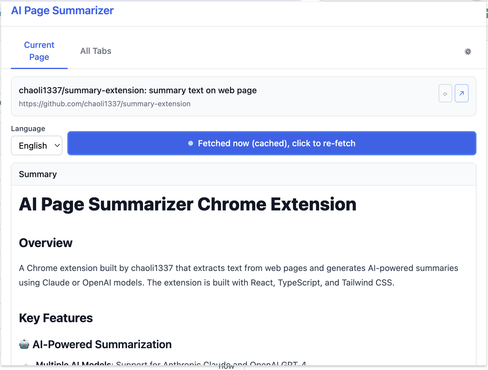
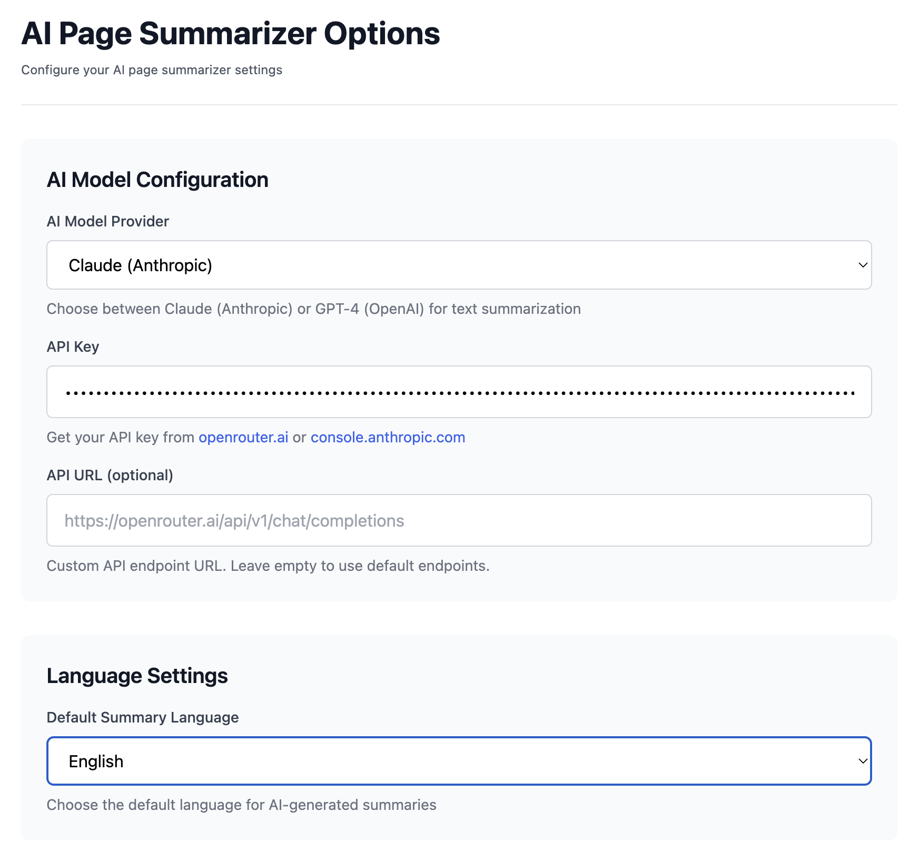
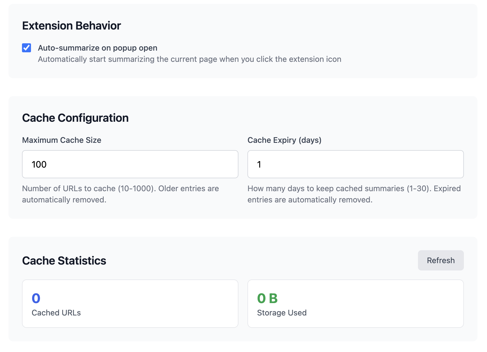

# Adding Screenshots to README

When you have the screenshot files ready, follow these steps:

## 1. Save Screenshots
Place your screenshot files in the `screenshots/` directory with these exact names:
- `main-interface.png`
- `ai-configuration.png`
- `behavior-cache.png`

## 2. Update README
Replace the current Screenshots section in `README.md` with this code:

```markdown
## Screenshots

### Main Extension Interface

*The main popup interface showing the current page summary with language selection and re-fetch options. Features a clean design with navigation tabs, page information, and AI-generated summaries with markdown formatting.*

### AI Model Configuration

*Settings page for configuring AI model providers (Claude/OpenAI), API keys, and custom endpoints. Includes language settings and API testing functionality.*

### Extension Behavior & Cache Settings

*Configuration options for extension behavior, caching settings, and storage statistics. Allows users to customize auto-summarization, cache size, and expiry settings.*
```

## 3. Remove Helper Files
After adding the screenshots, you can delete:
- `add-screenshots.md` (this file)
- `screenshots/README.md`

## Quick Command
Once you have the images, you can run this command to update the README:

```bash
# Replace the Screenshots section with the image version
sed -i '' '/## Screenshots/,/<!--/c\
## Screenshots\
\
### Main Extension Interface\
\
*The main popup interface showing the current page summary with language selection and re-fetch options. Features a clean design with navigation tabs, page information, and AI-generated summaries with markdown formatting.*\
\
### AI Model Configuration\
\
*Settings page for configuring AI model providers (Claude/OpenAI), API keys, and custom endpoints. Includes language settings and API testing functionality.*\
\
### Extension Behavior & Cache Settings\
\
*Configuration options for extension behavior, caching settings, and storage statistics. Allows users to customize auto-summarization, cache size, and expiry settings.*\
' README.md
```
